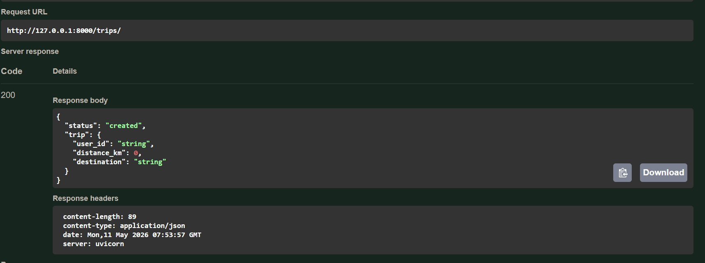
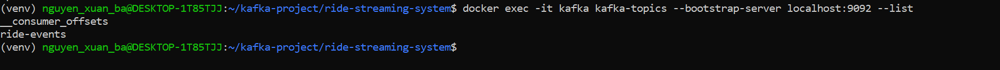
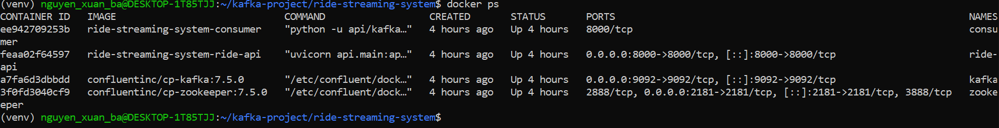
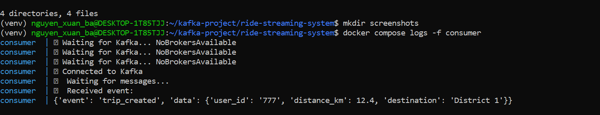

# 🚖 Ride Streaming Platform (Uber-like Real-Time System)

A distributed real-time ride-hailing streaming platform inspired by Uber’s event-driven architecture.

Built using **FastAPI, Apache Kafka, Docker, and Databricks**, this project simulates a production-grade streaming pipeline handling ride lifecycle events (create, pickup, dropoff, cancel).

---

## 🏗️ System Architecture


---

## 📦 System Components

### 1. 🚀 FastAPI Service (Producer)
- REST API for ride requests
- Generates trip events
- Publishes events to Kafka

### 2. 📨 Kafka Streaming Layer
- Apache Kafka (Confluent)
- Topic: `ride-events`
- Acts as event backbone of system

### 3. ⚙️ Consumer Service
- Python Kafka Consumer
- Processes incoming ride events
- Handles event transformation logic

### 4. 📊 Databricks Analytics Layer
- Stream processing with Spark
- Real-time analytics pipelines
- Data lake integration ready

---

## ⚙️ Tech Stack

- FastAPI
- Apache Kafka (Confluent)
- Zookeeper
- Python Kafka Client
- Docker & Docker Compose
- Databricks
- Pydantic

---

## 🚀 Features

- Real-time event-driven architecture
- Ride lifecycle events (create, pickup, dropoff, cancel)
- Kafka-based streaming pipeline
- Microservices architecture
- Fully Dockerized system
- Databricks-ready data pipeline
- JSON event schema design
- Scalable producer-consumer model

---

## 📡 API Specification

### ➤ Create Trip

**POST** `/trips/`

### Request

```json
{
  "user_id": "999",
  "distance_km": 8.5,
  "destination": "District 7"
}
```

---

### Response

```json id="response1"
{
  "status": "created",
  "trip": {
    "user_id": "999",
    "distance_km": 8.5,
    "destination": "District 7"
  }
}
```

---

## 📊 Kafka Event Schema

```json id="event1"
{
  "event": "trip_created",
  "data": {
    "user_id": "999",
    "distance_km": 8.5,
    "destination": "District 7"
  }
}
```

---

## 🐳 How to Run

```bash
docker compose up --build
```

---

## 🔗 Services

| Service       | URL                          |
|--------------|------------------------------|
| FastAPI      | http://localhost:8000        |
| Swagger UI   | http://localhost:8000/docs   |
| Kafka Broker | localhost:9092               |
| Zookeeper    | localhost:2181               |

---

## 📸 Screenshots

### 🔹 FastAPI Swagger UI


### 🔹 Kafka Topics


### 🔹 Docker Containers (Microservices)


### 🔹 Kafka Consumer Logs (Real-time Processing)


---

## 🧠 System Design Highlights

- Event-driven architecture (EDA)
- Decoupled microservices using Kafka
- Scalable producer-consumer pipeline
- Real-time stream processing
- Fault-tolerant distributed system
- Cloud-ready Databricks integration

---

## 📈 Real-World Mapping (Uber-like System)

| Component | Real System Equivalent |
|----------|----------------------|
| FastAPI | Trip Service |
| Kafka | Event Streaming Backbone |
| Consumer | Dispatch / Processing Engine |
| Databricks | Analytics / Data Platform |

---

## 👨‍💻 Author

Nguyen Xuan Ba  
Aspiring Data Engineer | Kafka | Streaming Systems | Backend Architecture

---

## 🏁 Project Status

✔ End-to-end streaming pipeline  
✔ Kafka event system working  
✔ Fully containerized microservices  
✔ Databricks integration ready  
✔ Portfolio-ready (FAANG-level foundation)
